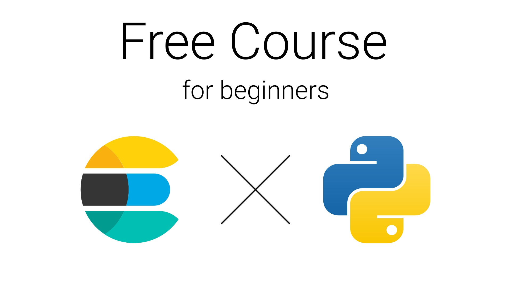
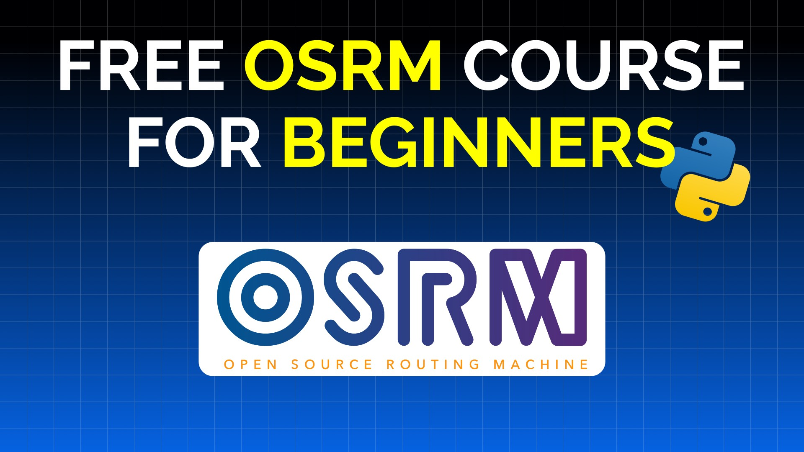
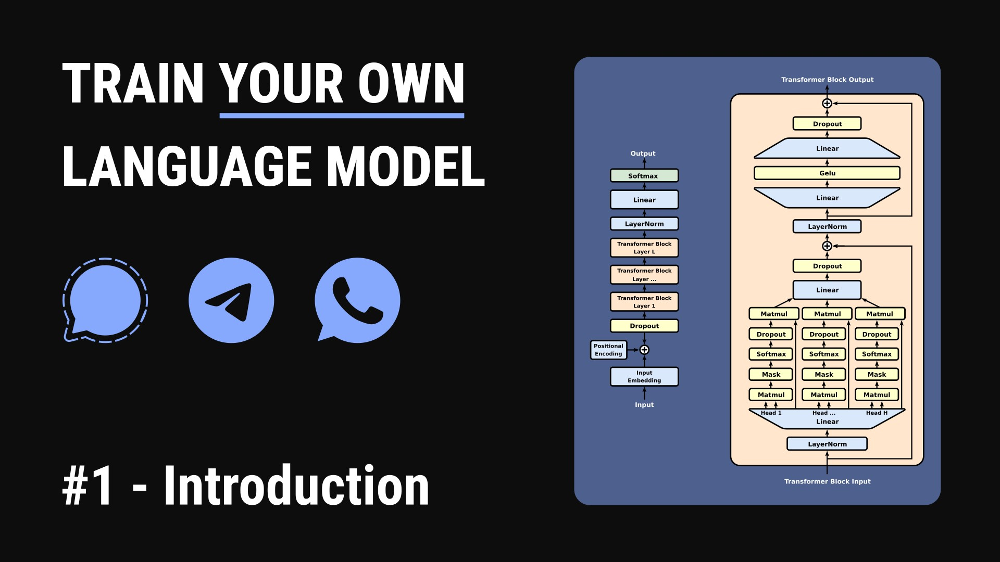
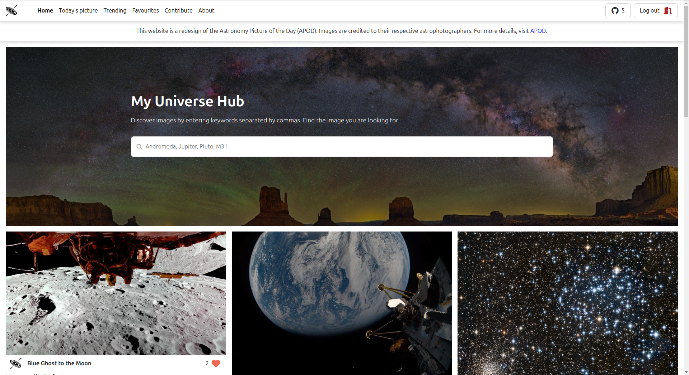
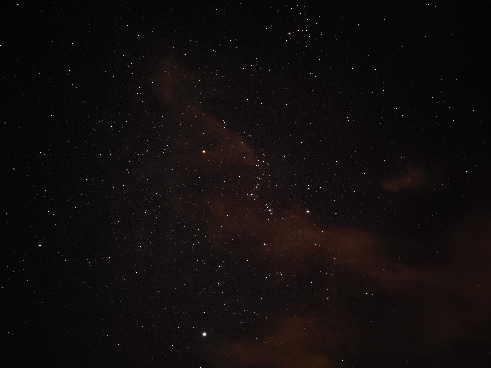

# About me

I am Imad Saddik, I've found my passion at the intersection of electrical engineering, programming, and astronomy. My journey began in electrical engineering, where I spent five years exploring everything about that field.

While I haven't formally studied astronomy at a university, it's been a lifelong fascination. From a young age, I've pursued this interest independently, driven by curiosity and wonder. Now, as I look to the future, I'm particularly excited about the potential of AI in advancing our understanding of the universe and aiding space exploration.

I believe that developing AI applications for space exploration is fascinating and also important for pushing the boundaries of human knowledge. It's in this area where I want to make my mark in the future.

## Skills & Technologies

### 🤖 Machine learning

### 💻 Software development

### 🌐 Web development

### 📊 Databases

### 🎮 Game development

### 📱 Android development

### 🎨 Multimedia tools

### 🤝🏻 You want to talk to me?

 

## Courses I have created

I find joy in sharing knowledge and teaching others, and it also serves as an effective way for me to learn new technologies.

### 1. Elasticsearch course for beginners

This course is made for beginners who want to learn Elasticsearch with the Python client. I covered a lot of topics, like creating indexes, adding documents, using query DSL, the search API, and more.

### 2. Open Source Routing Machine with Python

This course is made for beginners who want to learn OSRM, a free and open-source routing engine, with Python. I covered a lot of topics, like solving complex routing problems, the Traveling Salesman Problem, point-to-network snapping, GPS trace processing, and more.

### 3. Train a Language Model from scratch

This course is made for beginners who want to learn how to train a language model from scratch to talk like a person. I covered a lot of topics, like using chat data from platforms like WhatsApp and Telegram, preparing the data, training the base model, fine-tuning, and more.

## Projects shipped to production

### My Universe Hub

I am an astronomy enthusiast who discovered a passion for the cosmos at 19. Captivated by the stunning images shared by NASA, ESA, CSA, and APOD (Astronomy Picture of the Day), I noticed that APOD's website looked a bit outdated. Since I've been learning web development, I decided to create My Universe Hub, a modern, interactive, and visually engaging version of APOD.

The website is built using Vue.js for the frontend and Django with SQLite for the backend After investing over a year of hard work into this project, I'm excited to share it with the world and invite others to explore and contribute.

## 🌌 Astrophotography

I love astrophotography. I enjoy taking pictures of the night sky with my phone and telescope. This photo of Orion was taken at Bir Tam Tam, Morocco, and it's one of my favorites.

