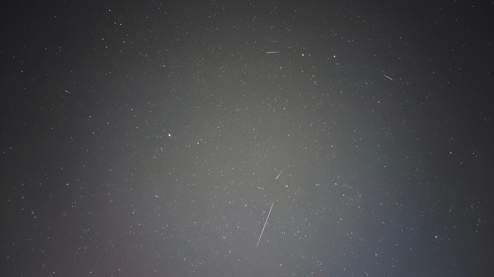

# About me

I am Imad Saddik, I've found my passion at the intersection of electrical engineering, programming, and astronomy. My journey began in electrical engineering, where I spent five years exploring everything about that field.

While I haven't formally studied astronomy at a university, it's been a lifelong fascination. From a young age, I've pursued this interest independently, driven by curiosity and wonder. Now, as I look to the future, I'm particularly excited about the potential of AI in advancing our understanding of the universe and aiding space exploration.

I believe that developing AI applications for space exploration is fascinating and also important for pushing the boundaries of human knowledge. It's in this area where I want to make my mark in the future.

## Skills & Technologies

### Machine & deep learning

### Software development

### Web development

### Databases

## Courses I have created

I find joy in sharing knowledge and teaching others, and it also serves as an effective way for me to learn new technologies.

<table align="center">
    <tr>
        <td align="center" width="50%">
            
             
            <h3>Train a language model from scratch</h3>
            
            
            
This course teaches how to train a language model from scratch to talk like a person.

        </td>
        <td align="center" width="50%">
            
             
            <h3>Elasticsearch course for beginners</h3>
            
            
            
Learn Elasticsearch with the Python client, from creating indexes to using query DSL.

        </td>
    </tr>
    <tr>
        <td align="center" width="50%">
            
             
            <h3>Open source routing machine with Python</h3>
            
            
Learn to solve complex routing problems with OSRM, a free routing engine.

        </td>
        <td align="center" width="50%">
        
         
        <h3>Evolution of the Transformer architecture</h3>
        
        
        
A full course on the evolution of the Transformer architecture from 2017 to 2025.

        </td>
    </tr>
</table>

## Projects shipped to production

### My Universe Hub

I am an astronomy enthusiast who discovered a passion for the cosmos at 19. Captivated by the stunning images shared by NASA, ESA, CSA, and APOD (Astronomy Picture of the Day), I noticed that APOD's website looked a bit outdated. Since I've been learning web development, I decided to create My Universe Hub, a modern, interactive, and visually engaging version of APOD.

The website is built using Vue.js for the frontend and Django with SQLite for the backend After investing over a year of hard work into this project, I'm excited to share it with the world and invite others to explore and contribute.

## Astrophotography

I love astrophotography. I enjoy taking pictures of the night sky with my phone and telescope. Here are some of my favorite shots:

<table align="center">
    <tr>
        <td align="center" width="50%">
            
             
            <h3>Orion at Bir Tam Tam, Morocco</h3>
            
A photo of Orion taken with my Vivo X50 Pro phone.

        </td>
        <td align="center" width="50%">
            
             
            <h3>The Milky way at Oued Amlil, Morocco</h3>
            
A shot of the Milky way core taken with my Canon 1300D.

        </td>
    </tr>
    <tr>
        <td align="center" width="50%">
            
             
            <h3>Star trails at Oued Amlil, Morocco</h3>
            
A long exposure photo capturing the star trails over Oued Amlil.

        </td>
        <td align="center" width="50%">
            
             
            <h3>Geminids meteor shower at Meknes, Morocco</h3>
            
Captured few meteors with my Vivo X50 Pro phone.

        </td>
    </tr>
</table>

## Let's connect

I am always open to new opportunities and collaborations. If you are interested in working together or have any questions, feel free to reach out to me.

**Email:** [simad3647@gmail.com](mailto:simad3647@gmail.com)

**LinkedIn:** [Imad Saddik](https://www.linkedin.com/in/imadsaddik/)

**Discord:** [imad_saddik](https://discord.com/users/imad_saddik)

